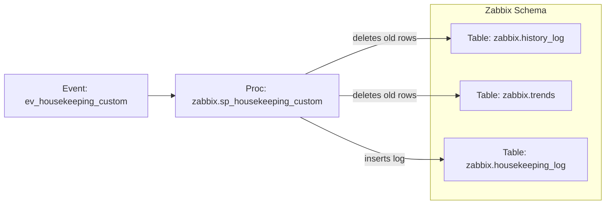

# Database Housekeeping for Zabbix Tables
<div align="center">

</div>

## 1. Project Overview
This project provides a MySQL process to perform automated housekeeping (time‑based deletion) on large tables. It also records detailed execution metrics in a centralized housekeeping log for auditability and operations insight for the Zabbix Monitoring solution.


The housekeeping is engineered based on these principles:
- Deterministic deletes >> MySQL group replication compatible
- Bounded batch size >> Binlog friendly
- Repeatable housekeeping >> Predictiable load for the db system

## 2. Architecture & Concepts

Key concepts
- **Time‑series housekeeping:** Remove rows older than a configurable retention based on `clock`.
- **Operational logging:** Persist run metadata (who, when, how many rows, duration, executed SQL) to `housekeeping_log`.
- **Scheduler orchestration:** A hourly event triggers the procedure for selected tables.

The design centers on a **parameterized stored procedure** that:
- Safely performs a **dynamic DELETE** against a target table based on a retention period (in days) evaluated against a `clock` timestamp column.
- Measures execution time, captures rows deleted, and **logs each run** to a `housekeeping_log` table.
- A **MySQL Event** schedules the procedure to run daily and invokes it for specific target tables with table‑specific retention periods.

## 3. SQL Object Inventory

### Tables
- `housekeeping_log`  
  Purpose: Central log for housekeeping runs.  
  Columns used by the procedure :

### Stored Procedures
- `sp_housekeeping_history_trends` 
  *Purpose:* Delete rows older than a specified retention (days) from history and trend tables and log the run.  
  *Inputs:*  
  - `p_schema_name VARCHAR(128)` — Target schema for deletion.  
  - `p_table_name VARCHAR(128)` — Target table for deletion.  
  - `p_retention BIGINT UNSIGNED` — Retention in **days**; must be `>= 1`.  
  - `p_reason VARCHAR(1024)` — Free‑text reason for audit logging.  

- `sp_housekeeping_audit` 
  *Purpose:* Delete rows older than a specified retention (days) from audit tables and log the run.  
  *Inputs:*  
  - `p_schema_name VARCHAR(128)` — Target schema for deletion.  
  - `p_table_name VARCHAR(128)` — Target table for deletion.  
  - `p_retention BIGINT UNSIGNED` — Retention in **days**; must be `>= 1`.  
  - `p_reason VARCHAR(1024)` — Free‑text reason for audit logging.  


### Events / Schedulers
- `ev_housekeeping_custom` (MySQL Event)  
  *Purpose:* Run every full hour housekeeping procedures.  
  *Schedule:* `STARTS TIMESTAMP( CURRENT_DATE + INTERVAL (HOUR(NOW()) + 1) HOUR,'00:00:00' `.  


### Sequences / Synonyms / Views / Triggers
- _None._

## 4. Dependencies Between SQL Objects
- **`ev_housekeeping_custom` → `zabbix.sp_housekeeping_custom`**  
  The event calls the stored procedure twice daily with table‑specific retention settings.

- **`sp_housekeeping_custom` → `target tables`**  
  The procedure **deletes** from the parameterized table \"\<schema\>\".\"\<table\>\" where `clock` is older than `NOW() - INTERVAL <retention> DAY`.

- **`sp_housekeeping_custom` → `housekeeping_log`**  
  After each delete, the procedure **inserts** a log entry capturing the action and performance metrics.

**Central/critical objects**
- `housekeeping_log` is central for observability and audit.  
- The `clock` column in target tables is critical to the retention logic.

### 4.1 Visual Dependency Diagrams



## 5. Installation & Deployment

Execute python script sp_housekeeping_custom.py via MySQL Shell which will create all necessary db objects:

```
$ mysqlsh admin@MYSQLSYSTEM --py
MySQL Shell 8.4.6
...
MySQL MYSQLSYSTEM:33060+ ssl Py> \source sp_housekeeping_custom.py
```

**Script creation order (implied by dependencies):**
1. **Create Indexes** `idx_<TABLENAME>_clock`
1. **Create table** `housekeeping_log`
2. **Create the stored procedures** `sp_housekeeping_audit` and `sp_housekeeping_history_trends` 
3. **Create the event** `ev_housekeeping_custom`


## 6. Operational Notes (Optional)
- **Safety checks:** The procedure validates inputs and signals errors for empty schema/table or invalid retention (`< 1`).  
- **Escaping & SQL safety:** Identifiers are backtick‑escaped to guard against injection via schema/table names.  
- **Timing & metrics:** Duration is measured at microsecond precision; `ROW_COUNT()` captures affected rows.  
- **Auditability:** Each run records `CURRENT_USER()`, timestamps (`started_at`, `finished_at`, `executed_at`), and the exact SQL used.  
- **Scheduler behavior:** Runs **daily at 22:00** (server time). Ensure `event_scheduler=ON`.  
- **Table prerequisites:** Target Zabbix related tables must have a numeric `clock` column comparable to `UNIX_TIMESTAMP(...)`.  

## 7. Limitations & Assumptions
- **Assumption:** The procedure resides in (or is referenced from) the `zabbix` schema, matching the event’s `CALL zabbix.sp_housekeeping_custom(...)`.  
- **Assumption:** Target tables (`zabbix.history_log`, `zabbix.trends`, ...) contain a `clock` column suitable for comparison with `UNIX_TIMESTAMP(NOW() - INTERVAL <retention> DAY)`.  

