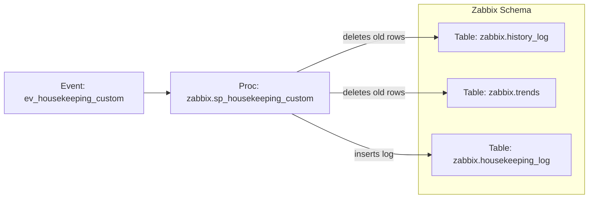

# Database Housekeeping for Zabbix Tables
## Version 1.2 - 08-April-2026
<div align="center">

</div>

## 1. Project Overview
The internal Zabbix housekeeping mechanism becomes inefficient when the system exceeds 100,000 items. A significant portion of the Zabbix manager's time is spent handling housekeeping. This project provides an alternative, custom housekeeping solution located inside the MySQL database. It also records detailed execution metrics in a centralized log to provide auditability and operational insight into the Zabbix monitoring solution.

Housekeeping is engineered based on these principles:
- Runs automatically inside the database
- Deterministic deletes compatible with MySQL group replication
- Bounded batch size: Binlog-friendly
- Repeatable housekeeping: predictable load for the database system

## 2. Scope
- Supported and tested Zabbix version: 7.4.0
- Just for Zabbix installation using Oracle/Percona MySQL as backend and are >= version 8.0

## 3. Architecture & Concepts

Key concepts
- **Time‑series housekeeping:** Remove rows older than a configurable retention based on `clock`.
- **Operational logging:** Persist run metadata (who, when, how many rows, duration, executed SQL) to `housekeeping_log`.
- **Scheduler orchestration:** A hourly event triggers the procedure for selected tables.

## 4. Zabbix affected tables
- history
- history_uint
- history_str
- history_text
- history_log 
- trends
- trends_uint            
- auditlog

## 5. Housekeeping Database Objects

| Indexes | Tables | Stored Procedures | Events |  Sequences / Synonyms / Views / Triggers              |
|---------|---------|---------|---------|---------|
| idx_history_clock | housekeeping_log | sp_housekeeping_history_trends | ev_housekeeping_custom | None |
| idx_history_log_clock |               | sp_housekeeping_audit         |                         |     |
| idx_history_str_clock | | | | |
| idx_history_text_clock | | | | |
| idx_history_uint_clock | | | | |
| idx_trends_clock | | | | |
| idx_trends_uint_clock | | | | |

## 6. Dependencies Between SQL Objects
- **`ev_housekeeping_custom` → `zabbix.sp_housekeeping_custom`**  
  The event calls the stored procedure hourly with table‑specific retention settings.

- **`sp_housekeeping_custom` → `target tables`**  
  The procedure **deletes** from the parameterized table \"\<schema\>\".\"\<table\>\" where `clock` is older than `<retention>`.

- **`sp_housekeeping_custom` → `housekeeping_log`**  
  After each delete, the procedure **inserts** a log entry capturing the action and performance metrics.

**Central/critical objects**
- `housekeeping_log` is central for observability and audit.  
- The `clock` column in target tables is critical to the retention logic.

### 6.1 Visual Dependency Diagrams



## 7. Installation & Deployment

Execute python script sp_housekeeping_custom.py via MySQL Shell which will create all necessary db objects:

```
$ mysqlsh admin@mysqlserver --database zabbix --py
MySQL Shell 8.4.6
...
mysqlserver:33060+ ssl zabbix Py> \source sp_housekeeping_custom.py
```

**Deployment order:**
1. Script: Create Indexes `idx_<TABLENAME>_clock`
1. Script: Create table `housekeeping_log`
2. Script: Create the stored procedures `sp_housekeeping_audit` and `sp_housekeeping_history_trends` 
3. Script: Create the event `ev_housekeeping_custom`
4. Manual: **For safety reasons event is disabled by default, therefore you have to activated by sql-statement `ALTER EVENT ev_housekeeping_custom ENABLE;`**
5. Manual: Once event is activated, disable Zabbix internal housekeeping for sections "History", "Trends" and "Auditlog".


## 8. Operational Notes
- **Security:** Identifiers are backtick‑escaped to guard against injection via schema/table names.  
- **Timing & metrics:** Duration is measured at microsecond precision; `ROW_COUNT()` captures affected rows.  
- **Auditability:** Each run records `CURRENT_USER()`, timestamps (`started_at`, `finished_at`, `executed_at`), and the exact SQL used.  
- **Table prerequisites:** Target Zabbix related tables must have a numeric `clock` column comparable to `UNIX_TIMESTAMP(...)`.  

## 9. Limitations & Assumptions
- **Assumption:** The procedure resides in (or is referenced from) the `zabbix` schema, matching the event’s `CALL zabbix.sp_housekeeping_custom(...)`.  
- **Assumption:** Target tables (`zabbix.history_log`, `zabbix.trends`, ...) contain a `clock` column suitable for comparison with `UNIX_TIMESTAMP(NOW() - INTERVAL <retention> DAY)`.  
- **Limitation:** When using group replication HA-feature and a failover has occured, the event "ev_housekeeping_custom" will get in status `REPLICA_SIDE_DISABLED` and won't executed anymore. By using the command "ALTER EVENT ev_housekeeping_custom ENABLE;" it will activated again.

