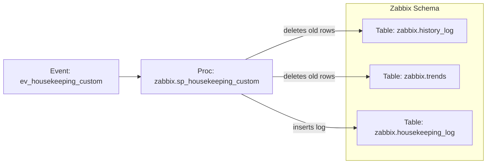

# Database Housekeeping for Zabbix Tables

## 1. Project Overview
This project provides a MySQL stored procedure and a scheduled event to perform automated housekeeping (time‑based deletion) on large, append‑only time‑series tables. It also records detailed execution metrics in a centralized housekeeping log for auditability and operations insight.

**Primary domain:** operational housekeeping / data retention for monitoring or telemetry data

## 2. Architecture & Concepts

**Key concepts / data domains**
- **Time‑series housekeeping:** Remove rows older than a configurable retention based on `clock`.
- **Operational logging:** Persist run metadata (who, when, how many rows, duration, executed SQL) to `housekeeping_log`.
- **Scheduler orchestration:** A daily event triggers the procedure for selected tables.

The design centers on a **parameterized stored procedure** that:
- Safely performs a **dynamic DELETE** against a target table based on a retention period (in days) evaluated against a `clock` timestamp column.
- Measures execution time, captures rows deleted, and **logs each run** to a `housekeeping_log` table.

A **MySQL Event** schedules the procedure to run daily and invokes it for specific target tables with table‑specific retention periods.

## 3. SQL Object Inventory

### Tables
- `housekeeping_log`  
  *Purpose:* Central log for housekeeping runs.  
  *Columns used by the procedure (must exist):*
  - `schema_name`, `table_name`, `deleted_rows`, `duration_us`,
  - `deleted_by`, `executed_at`, `started_at`, `finished_at`,
  - `reason`, `sql_statement`.

- `zabbix.history_log`  
  *Purpose:* Time‑series history (inferred from name). Must contain a `clock` column comparable to `UNIX_TIMESTAMP(...)`.

- `zabbix.trends`  
  *Purpose:* Aggregated/rolled‑up time‑series trends (inferred from name). Must contain a `clock` column comparable to `UNIX_TIMESTAMP(...)`.

> **Note:** Only the above tables are referenced (directly or through parameters). The procedure is generic and can target any table `<schema>.<table>` that contains a `clock` field of a compatible numeric type.

### Stored Procedures
- `sp_housekeeping_custom` (Stored Procedure)  
  *Purpose:* Delete rows older than a specified retention (days) from a target table and log the run.  
  *Inputs:*  
  - `p_schema_name VARCHAR(128)` — Target schema for deletion.  
  - `p_table_name VARCHAR(128)` — Target table for deletion.  
  - `p_retention BIGINT UNSIGNED` — Retention in **days**; must be `>= 1`.  
  - `p_reason VARCHAR(1024)` — Free‑text reason for audit logging.  
  *Behavior & key logic:*  
  - Validates inputs (non‑empty schema/table; retention `>= 1`).  
  - Builds a **dynamic** `DELETE FROM \`<schema>\`.\`<table>\` WHERE clock < UNIX_TIMESTAMP(NOW() - INTERVAL <retention> DAY)` with backtick‑escaping.  
  - Measures duration (`NOW(6)`, `TIMESTAMPDIFF(MICROSECOND, ...)`).  
  - Captures `ROW_COUNT()` for deleted rows.  
  - Inserts a log row into `housekeeping_log` with the generated SQL and metadata.  
  *Reads/Writes:*  
  - **Deletions on target tables:** deletes old rows (DML).  
  - **Writes:** inserts execution log.

### Events / Schedulers
- `ev_housekeeping_custom` (MySQL Event)  
  *Purpose:* Run daily housekeeping at a fixed time.  
  *Schedule:* `EVERY 1 DAY STARTS TIMESTAMP(CURRENT_DATE, '22:00:00')`.  
  *Actions:*  
  - `CALL zabbix.sp_housekeeping_custom( <SCHEMA> , <TABLE>, <RETENTION-DAYS>, <COMMENT>);`  

### Sequences / Synonyms / Other
- _None._

### Views
- _None._

### Triggers
- _None._

## 4. Dependencies Between SQL Objects
- **`ev_housekeeping_custom` → `zabbix.sp_housekeeping_custom`**  
  The event calls the stored procedure twice daily with table‑specific retention settings.

- **`sp_housekeeping_custom` → target tables**  
  The procedure **deletes** from the parameterized table \"\<schema\>\".\"\<table\>\" where `clock` is older than `NOW() - INTERVAL <retention> DAY`.

- **`sp_housekeeping_custom` → `housekeeping_log`**  
  After each delete, the procedure **inserts** a log entry capturing the action and performance metrics.

**Central/critical objects**
- `housekeeping_log` is central for observability and audit.  
- The `clock` column in target tables is critical to the retention logic.

### 4.1 Visual Dependency Diagrams (Mermaid)

**Core data flow (scheduled housekeeping)**

## 5. Installation & Deployment
**Creation order (implied by dependencies):**
1. **Create table** `housekeeping_log` with at least the columns used by the procedure:
   - `schema_name`, `table_name`, `deleted_rows`, `duration_us`,
   - `deleted_by`, `executed_at`, `started_at`, `finished_at`,
   - `reason`, `sql_statement`.
2. **Create the stored procedure** `sp_housekeeping_custom` in the intended schema (the event calls it as `zabbix.sp_housekeeping_custom`, so ensure it exists in `zabbix` or adjust the event accordingly).
3. **Create the event** `ev_housekeeping_custom` (ensure the MySQL Event Scheduler is enabled).

## 6. Operational Notes (Optional)
- **Safety checks:** The procedure validates inputs and signals errors for empty schema/table or invalid retention (`< 1`).  
- **Escaping & SQL safety:** Identifiers are backtick‑escaped to guard against injection via schema/table names.  
- **Timing & metrics:** Duration is measured at microsecond precision; `ROW_COUNT()` captures affected rows.  
- **Auditability:** Each run records `CURRENT_USER()`, timestamps (`started_at`, `finished_at`, `executed_at`), and the exact SQL used.  
- **Scheduler behavior:** Runs **daily at 22:00** (server time). Ensure `event_scheduler=ON`.  
- **Table prerequisites:** Target Zabbix related tables must have a numeric `clock` column comparable to `UNIX_TIMESTAMP(...)`.  

## 7. Limitations & Assumptions
- **Assumption:** The procedure resides in (or is referenced from) the `zabbix` schema, matching the event’s `CALL zabbix.sp_housekeeping_custom(...)`.  
- **Assumption:** Target tables (`zabbix.history_log`, `zabbix.trends`, ...) contain a `clock` column suitable for comparison with `UNIX_TIMESTAMP(NOW() - INTERVAL <retention> DAY)`.  
- **Operational requirement:** Appropriate privileges are required to create procedures/events and to delete from target tables and insert into `housekeeping_log`.  
- **Time zone:** The 22:00 schedule follows the server’s time zone configuration. Adjust as needed for your operations window.
